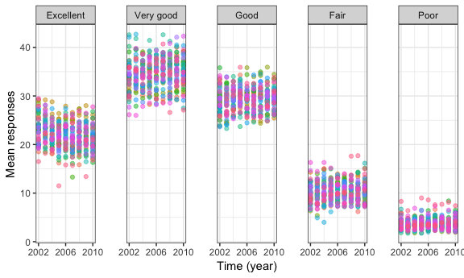
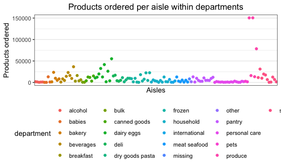

p8105\_hw3\_aar2192
================
Amadeia Rector
10/12/2018

Problem 1
---------

#### Loading data from BRFSS

``` r
devtools::install_github("p8105/p8105.datasets", force = TRUE)
```

    ## Downloading GitHub repo p8105/p8105.datasets@master
    ## from URL https://api.github.com/repos/p8105/p8105.datasets/zipball/master

    ## Installing p8105.datasets

    ## '/Library/Frameworks/R.framework/Resources/bin/R' --no-site-file  \
    ##   --no-environ --no-save --no-restore --quiet CMD INSTALL  \
    ##   '/private/var/folders/h0/745bvl6520dfjw96s7mndz_40000gq/T/RtmpsF2oz5/devtools6ca762a5cb4b/P8105-p8105.datasets-21f5ad1'  \
    ##   --library='/Library/Frameworks/R.framework/Versions/3.5/Resources/library'  \
    ##   --install-tests

    ## 

``` r
library(p8105.datasets)
data("brfss_smart2010")
```

#### Cleaning BRFSS datasest

``` r
brfss_smart2010_clean =
  brfss_smart2010 %>% 
  janitor::clean_names() %>% 
  rename(state = locationabbr, county = locationdesc) %>% 
  separate(county, into = c("trash", "county"), sep = " - ") %>% 
  select(-trash) %>% 
  filter(topic == "Overall Health") %>% 
  mutate(response = factor(response, levels = c("Excellent", "Very good", "Good","Fair","Poor")))
```

#### In 2002, which states were observed at 7 locations?

``` r
brfss_smart2010_clean %>% 
  filter(year == 2002) %>%
  group_by(state, year) %>%
  summarize(distinct_counties = n_distinct(county)) %>% 
  filter(distinct_counties==7)
```

    ## # A tibble: 3 x 3
    ## # Groups:   state [3]
    ##   state  year distinct_counties
    ##   <chr> <int>             <int>
    ## 1 CT     2002                 7
    ## 2 FL     2002                 7
    ## 3 NC     2002                 7

Connecticut, Florida, and North Carolina were observed in 7 locations or counties in 2002.

#### Spaghetti plot for number of locations 2002-10

``` r
  brfss_smart2010_clean %>% 
  group_by(state, year) %>%
  summarize(distinct_counties = n_distinct(county)) %>% 
  ggplot(aes(x = year, y = distinct_counties, group = state)) +
    geom_line(aes(color = state))+
  labs(title = "Counties observed per year by state", x = "Time (years)", y = "Number of counties") +
  theme(legend.position = "none", plot.title = element_text(hjust = 0.5))
```


#### Table showing proportion of excellent responses for years 2002, 2006, and 2010 by NY counties

``` r
brfss_smart2010_clean %>% 
  filter(state == "NY", year %in% c(2002, 2006, 2010), response == "Excellent") %>%
  group_by(county) %>% 
  summarize(mean_excellent = mean(data_value), sd_excellent = sd(data_value)) %>% 
  select(county, mean_excellent, sd_excellent) %>% 
  rename("Mean excellent response" = mean_excellent, "Standard deviation excellent response" = sd_excellent) %>% 
  knitr::kable()
```

| county             |  Mean excellent response|  Standard deviation excellent response|
|:-------------------|------------------------:|--------------------------------------:|
| Bronx County       |                 17.60000|                                     NA|
| Erie County        |                 17.20000|                                     NA|
| Kings County       |                 20.36667|                              1.7672955|
| Monroe County      |                 22.40000|                                     NA|
| Nassau County      |                 24.93333|                              2.8219379|
| New York County    |                 27.50000|                              1.5394804|
| Queens County      |                 19.63333|                              1.3576941|
| Suffolk County     |                 24.10000|                              3.2787193|
| Westchester County |                 26.45000|                              0.6363961|

#### Five panel plot of distribution of responses over time

``` r
brfss_response_df=
  brfss_smart2010_clean %>% 
  group_by(state, year, response) %>% 
  summarize(mean_response = mean(data_value))

ggplot(brfss_response_df, aes(x = year, y = mean_response, color = state))+
  geom_point(alpha = .5) +
  facet_grid(.~response) +
  labs( y = "Mean responses", x = "Time (year)") +
  theme(legend.position = "none", panel.spacing = unit(2, "lines")) +
  scale_x_continuous(breaks = c(2002, 2006, 2010))
```

    ## Warning: Removed 21 rows containing missing values (geom_point).

 \#\#Problem 2

#### Loading instacart data

``` r
data("instacart")
View(instacart)
summary(unique(instacart$department))
```

    ##    Length     Class      Mode 
    ##        21 character character

``` r
summary(unique(instacart$aisle))
```

    ##    Length     Class      Mode 
    ##       134 character character

``` r
summary(unique(instacart$product_name))
```

    ##    Length     Class      Mode 
    ##     39123 character character

``` r
summary(is.na(instacart))
```

    ##   order_id       product_id      add_to_cart_order reordered      
    ##  Mode :logical   Mode :logical   Mode :logical     Mode :logical  
    ##  FALSE:1384617   FALSE:1384617   FALSE:1384617     FALSE:1384617  
    ##   user_id         eval_set       order_number    order_dow      
    ##  Mode :logical   Mode :logical   Mode :logical   Mode :logical  
    ##  FALSE:1384617   FALSE:1384617   FALSE:1384617   FALSE:1384617  
    ##  order_hour_of_day days_since_prior_order product_name     aisle_id      
    ##  Mode :logical     Mode :logical          Mode :logical   Mode :logical  
    ##  FALSE:1384617     FALSE:1384617          FALSE:1384617   FALSE:1384617  
    ##  department_id     aisle         department     
    ##  Mode :logical   Mode :logical   Mode :logical  
    ##  FALSE:1384617   FALSE:1384617   FALSE:1384617

``` r
summarize(instacart, mean(days_since_prior_order))
```

    ## # A tibble: 1 x 1
    ##   `mean(days_since_prior_order)`
    ##                            <dbl>
    ## 1                           17.1

#### Describing the instacart data

The dataframe is in tibble format. There are 1,384,617 rows and 15 columns (variables) in the instacart dataset. The variables are listed as orded\_id, product\_id, add\_to\_cart\_order, reordered, user\_id, eval\_set, order\_number, order\_dow, order\_hour\_of\_day, days\_since\_prior\_order, product\_name, aisle\_id, department\_id, aisle, and department.

Most likely the key variables are department, aisle, order\_hour\_of\_day, product\_name. This would be because we might be interested in knowing what department and in what aisle are most products found. Then, we would want to know what are the most bought items, and at what time of the day do customers shop.

There are 21 departments, 134 aisles, and 39123 different product\_names. The mean number of days since prior order is 17.1 days. There doesn't appear to be any missing data.

#### How many aisles are there, and which aisles are the most items ordered from?

``` r
n_distinct(instacart$aisle)
```

    ## [1] 134

``` r
instacart %>% 
  group_by(aisle) %>%
  summarize(number_products = n()) %>% 
  arrange(min_rank(desc(number_products)))
```

    ## # A tibble: 134 x 2
    ##    aisle                         number_products
    ##    <chr>                                   <int>
    ##  1 fresh vegetables                       150609
    ##  2 fresh fruits                           150473
    ##  3 packaged vegetables fruits              78493
    ##  4 yogurt                                  55240
    ##  5 packaged cheese                         41699
    ##  6 water seltzer sparkling water           36617
    ##  7 milk                                    32644
    ##  8 chips pretzels                          31269
    ##  9 soy lactosefree                         26240
    ## 10 bread                                   23635
    ## # ... with 124 more rows

There are 134 different aisles. The fresh vegetables aisle is the aisle where the most products are ordered from.

#### Plot of items ordered by aisle

``` r
data_for_insta_plot =
  instacart %>% 
  group_by (aisle, department) %>% 
  summarize(number_products = n()) %>%
  arrange(department)

  data_for_insta_plot$aisle =
    factor(data_for_insta_plot$aisle, levels = unique(data_for_insta_plot$aisle))
  
  data_for_insta_plot %>% 
  ggplot(aes(x = aisle, y = number_products)) + 
  geom_point(aes(color = department)) +
  labs(title = "Products ordered per aisle within departments",
       y = "Products ordered", x = "Aisles") +
  scale_x_discrete(breaks = NULL) +
  theme(plot.title = element_text(hjust = 0.5))
```



#### Table of most popular items for aisles: “baking ingredients”, “dog food care”, and “packaged vegetables fruits”

``` r
instacart %>% 
  filter(aisle %in% c("baking ingredients", "dog food care", 
                      "packaged vegetables fruits")) %>%
  group_by(aisle, product_name)
```

    ## # A tibble: 93,193 x 15
    ## # Groups:   aisle, product_name [1,444]
    ##    order_id product_id add_to_cart_ord… reordered user_id eval_set
    ##       <int>      <int>            <int>     <int>   <int> <chr>   
    ##  1       36      43086                4         1   79431 train   
    ##  2       38      18159                2         0   42756 train   
    ##  3       38      21616                4         1   42756 train   
    ##  4       96      40706                3         1   17227 train   
    ##  5       96      27966                5         1   17227 train   
    ##  6       96      39275                7         1   17227 train   
    ##  7       98      27966               13         1   56463 train   
    ##  8       98      18117               30         1   56463 train   
    ##  9       98      36364               44         0   56463 train   
    ## 10      112      21174                2         1  125030 train   
    ## # ... with 93,183 more rows, and 9 more variables: order_number <int>,
    ## #   order_dow <int>, order_hour_of_day <int>,
    ## #   days_since_prior_order <int>, product_name <chr>, aisle_id <int>,
    ## #   department_id <int>, aisle <chr>, department <chr>
