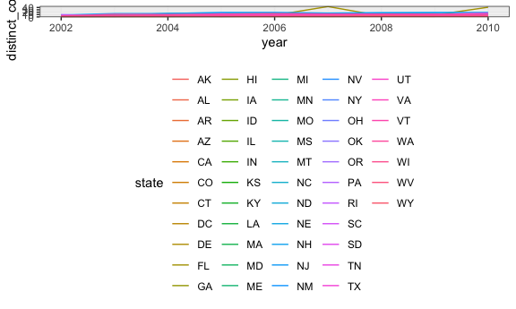

p8105\_hw3\_aar2192
================
Amadeia Rector
10/12/2018

Problem 1
---------

#### Loading data from B

``` r
devtools::install_github("p8105/p8105.datasets", force = TRUE)
```

    ## Downloading GitHub repo p8105/p8105.datasets@master
    ## from URL https://api.github.com/repos/p8105/p8105.datasets/zipball/master

    ## Installing p8105.datasets

    ## '/Library/Frameworks/R.framework/Resources/bin/R' --no-site-file  \
    ##   --no-environ --no-save --no-restore --quiet CMD INSTALL  \
    ##   '/private/var/folders/h0/745bvl6520dfjw96s7mndz_40000gq/T/RtmpqZbiuZ/devtools5acb7e6dd365/P8105-p8105.datasets-21f5ad1'  \
    ##   --library='/Library/Frameworks/R.framework/Versions/3.5/Resources/library'  \
    ##   --install-tests

    ## 

``` r
library(p8105.datasets)
data("brfss_smart2010")
```

#### Cleaning BRFSS datasest

``` r
brfss_smart2010_clean =
  brfss_smart2010 %>% 
  janitor::clean_names() %>% 
  rename(state = locationabbr, county = locationdesc) %>% 
  separate(county, into = c("trash", "county"), sep = " - ") %>% 
  select(-trash) %>% 
  filter(topic == "Overall Health") %>% 
  mutate(response = factor(response, levels = c("Excellent", "Very good", "Good","Fair","Poor")))
```

#### In 2002, which states were observed at 7 locations?

``` r
brfss_smart2010_clean %>% 
  filter(year == 2002) %>%
  group_by(state, year) %>%
  summarize(distinct_counties = n_distinct(county)) %>% 
  filter(distinct_counties==7)
```

    ## # A tibble: 3 x 3
    ## # Groups:   state [3]
    ##   state  year distinct_counties
    ##   <chr> <int>             <int>
    ## 1 CT     2002                 7
    ## 2 FL     2002                 7
    ## 3 NC     2002                 7

Connecticut, Florida, and North Carolina were observed in 7 locations or counties in 2002.

#### Spaghetti plot for number of locations 2002-10

``` r
brfss_smart2010_clean %>% 
  group_by(state, year) %>%
  summarize(distinct_counties = n_distinct(county)) %>% 
  ggplot(aes(x = year, y = distinct_counties, group = state)) +
    geom_line(aes(color = state))
```



#### Table showing proportion of excellent responses
