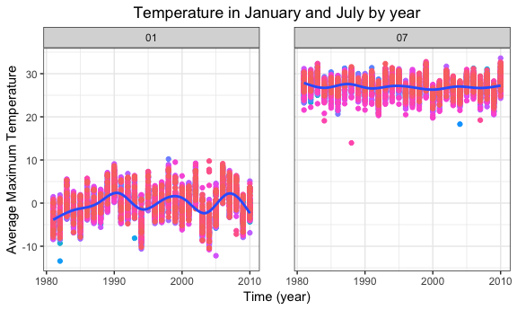
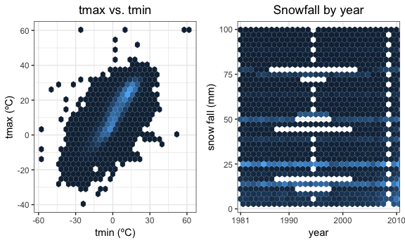

p8105\_hw3\_aar2192
================
Amadeia Rector
10/12/2018

Problem 1
---------

#### Loading data from BRFSS

``` r
devtools::install_github("p8105/p8105.datasets", force = TRUE)
```

    ## Downloading GitHub repo p8105/p8105.datasets@master
    ## from URL https://api.github.com/repos/p8105/p8105.datasets/zipball/master

    ## Installing p8105.datasets

    ## '/Library/Frameworks/R.framework/Resources/bin/R' --no-site-file  \
    ##   --no-environ --no-save --no-restore --quiet CMD INSTALL  \
    ##   '/private/var/folders/h0/745bvl6520dfjw96s7mndz_40000gq/T/Rtmp4eAUVC/devtools9ab73218da8/P8105-p8105.datasets-21f5ad1'  \
    ##   --library='/Library/Frameworks/R.framework/Versions/3.5/Resources/library'  \
    ##   --install-tests

    ## 

``` r
library(p8105.datasets)
data("brfss_smart2010")
```

#### Cleaning BRFSS datasest

``` r
brfss_smart2010_clean =
  brfss_smart2010 %>% 
  janitor::clean_names() %>% 
  rename(state = locationabbr, county = locationdesc) %>% 
  separate(county, into = c("trash", "county"), sep = " - ") %>% 
  select(-trash) %>% 
  filter(topic == "Overall Health") %>% 
  mutate(response = factor(response, levels = c("Excellent", "Very good", "Good","Fair","Poor")))
```

#### In 2002, which states were observed at 7 locations?

``` r
brfss_smart2010_clean %>% 
  filter(year == 2002) %>%
  group_by(state, year) %>%
  summarize(distinct_counties = n_distinct(county)) %>% 
  filter(distinct_counties==7)
```

    ## # A tibble: 3 x 3
    ## # Groups:   state [3]
    ##   state  year distinct_counties
    ##   <chr> <int>             <int>
    ## 1 CT     2002                 7
    ## 2 FL     2002                 7
    ## 3 NC     2002                 7

Connecticut, Florida, and North Carolina were observed in 7 locations or counties in 2002.

#### Spaghetti plot for number of locations 2002-10

``` r
  brfss_smart2010_clean %>% 
  group_by(state, year) %>%
  summarize(distinct_counties = n_distinct(county)) %>% 
  ggplot(aes(x = year, y = distinct_counties, group = state)) +
    geom_line(aes(color = state))+
  labs(title = "Counties observed per year by state", x = "Time (years)", y = "Number of counties") +
  theme(legend.position = "none", plot.title = element_text(hjust = 0.5))
```


#### Table showing proportion of excellent responses for years 2002, 2006, and 2010 by NY counties

``` r
brfss_smart2010_clean %>% 
  filter(state == "NY", year %in% c(2002, 2006, 2010), response == "Excellent") %>%
  group_by(county) %>% 
  summarize(mean_excellent = mean(data_value), sd_excellent = sd(data_value)) %>% 
  select(county, mean_excellent, sd_excellent) %>% 
  rename("Mean excellent response" = mean_excellent, "Standard deviation excellent response" = sd_excellent) %>% 
  knitr::kable()
```

| county             |  Mean excellent response|  Standard deviation excellent response|
|:-------------------|------------------------:|--------------------------------------:|
| Bronx County       |                 17.60000|                                     NA|
| Erie County        |                 17.20000|                                     NA|
| Kings County       |                 20.36667|                              1.7672955|
| Monroe County      |                 22.40000|                                     NA|
| Nassau County      |                 24.93333|                              2.8219379|
| New York County    |                 27.50000|                              1.5394804|
| Queens County      |                 19.63333|                              1.3576941|
| Suffolk County     |                 24.10000|                              3.2787193|
| Westchester County |                 26.45000|                              0.6363961|

#### Five panel plot of distribution of responses over time

``` r
brfss_response_df=
  brfss_smart2010_clean %>% 
  group_by(state, year, response) %>% 
  summarize(mean_response = mean(data_value))

ggplot(brfss_response_df, aes(x = year, y = mean_response, color = state))+
  geom_point(alpha = .5) +
  facet_grid(.~response) +
  labs( y = "Mean responses", x = "Time (year)") +
  theme(legend.position = "none", panel.spacing = unit(2, "lines")) +
  scale_x_continuous(breaks = c(2002, 2006, 2010))
```

    ## Warning: Removed 21 rows containing missing values (geom_point).

 \#\# Problem 2

#### Loading instacart data

``` r
data("instacart")
View(instacart)
summary(unique(instacart$department))
```

    ##    Length     Class      Mode 
    ##        21 character character

``` r
summary(unique(instacart$aisle))
```

    ##    Length     Class      Mode 
    ##       134 character character

``` r
summary(unique(instacart$product_name))
```

    ##    Length     Class      Mode 
    ##     39123 character character

``` r
summary(is.na(instacart))
```

    ##   order_id       product_id      add_to_cart_order reordered      
    ##  Mode :logical   Mode :logical   Mode :logical     Mode :logical  
    ##  FALSE:1384617   FALSE:1384617   FALSE:1384617     FALSE:1384617  
    ##   user_id         eval_set       order_number    order_dow      
    ##  Mode :logical   Mode :logical   Mode :logical   Mode :logical  
    ##  FALSE:1384617   FALSE:1384617   FALSE:1384617   FALSE:1384617  
    ##  order_hour_of_day days_since_prior_order product_name     aisle_id      
    ##  Mode :logical     Mode :logical          Mode :logical   Mode :logical  
    ##  FALSE:1384617     FALSE:1384617          FALSE:1384617   FALSE:1384617  
    ##  department_id     aisle         department     
    ##  Mode :logical   Mode :logical   Mode :logical  
    ##  FALSE:1384617   FALSE:1384617   FALSE:1384617

``` r
summarize(instacart, mean(days_since_prior_order))
```

    ## # A tibble: 1 x 1
    ##   `mean(days_since_prior_order)`
    ##                            <dbl>
    ## 1                           17.1

#### Describing the instacart data

The dataframe is in tibble format. There are 1,384,617 rows and 15 columns (variables) in the instacart dataset. The variables are listed as orded\_id, product\_id, add\_to\_cart\_order, reordered, user\_id, eval\_set, order\_number, order\_dow, order\_hour\_of\_day, days\_since\_prior\_order, product\_name, aisle\_id, department\_id, aisle, and department.

Most likely the key variables are department, aisle, order\_hour\_of\_day, product\_name. This would be because we might be interested in knowing what department and in what aisle are most products found. Then, we would want to know what are the most bought items, and at what time of the day do customers shop.

There are 21 departments, 134 aisles, and 39123 different product\_names. The mean number of days since prior order is 17.1 days. There doesn't appear to be any missing data.

#### How many aisles are there, and which aisles are the most items ordered from?

``` r
n_distinct(instacart$aisle)
```

    ## [1] 134

``` r
instacart %>% 
  group_by(aisle) %>%
  summarize(number_products = n()) %>% 
  arrange(min_rank(desc(number_products)))
```

    ## # A tibble: 134 x 2
    ##    aisle                         number_products
    ##    <chr>                                   <int>
    ##  1 fresh vegetables                       150609
    ##  2 fresh fruits                           150473
    ##  3 packaged vegetables fruits              78493
    ##  4 yogurt                                  55240
    ##  5 packaged cheese                         41699
    ##  6 water seltzer sparkling water           36617
    ##  7 milk                                    32644
    ##  8 chips pretzels                          31269
    ##  9 soy lactosefree                         26240
    ## 10 bread                                   23635
    ## # ... with 124 more rows

There are 134 different aisles. The fresh vegetables aisle is the aisle where the most products are ordered from.

#### Plot of items ordered by aisle

``` r
data_for_insta_plot =
  instacart %>% 
  group_by (aisle, department) %>% 
  summarize(number_products = n()) %>%
  arrange(department)

  data_for_insta_plot$aisle =
    factor(data_for_insta_plot$aisle, levels = unique(data_for_insta_plot$aisle))
  
  data_for_insta_plot %>% 
  ggplot(aes(x = aisle, y = number_products)) + 
  geom_point(aes(color = department)) +
  labs(title = "Products ordered per aisle within departments",
       y = "Products ordered", x = "Aisles") +
  scale_x_discrete(breaks = NULL) +
  theme(plot.title = element_text(hjust = 0.5))
```


#### Table of most popular items for aisles: “baking ingredients”, “dog food care”, and “packaged vegetables fruits”

``` r
instacart %>% 
  filter(aisle %in% c("baking ingredients", "dog food care", 
                      "packaged vegetables fruits")) %>%
  group_by(aisle, product_name) %>% 
  summarize(product_amt = n()) %>% 
  filter(min_rank(desc(product_amt)) < 2) %>% 
  rename("product name" = product_name, "Total sold" = product_amt) %>% 
  knitr::kable()
```

| aisle                      | product name                                  |  Total sold|
|:---------------------------|:----------------------------------------------|-----------:|
| baking ingredients         | Light Brown Sugar                             |         499|
| dog food care              | Snack Sticks Chicken & Rice Recipe Dog Treats |          30|
| packaged vegetables fruits | Organic Baby Spinach                          |        9784|

#### Table showing mean hour of day for pink lady apples and coffee ice cream

``` r
  instacart %>% 
  filter(product_name %in% c("Pink Lady Apples", "Coffee Ice Cream")) %>% 
  group_by(product_name,order_dow) %>% 
  summarize(mean_hour_dow = round(mean(order_hour_of_day))) %>% 
  spread(key = order_dow, value = mean_hour_dow) %>% 
  rename("Product" = product_name, "Sun" = '0', "Mon" = '1', "Tues" = '2', "Wed" = '3', "Thurs" = '4', "Fri" = '5', "Sat" = '6') %>%
  knitr::kable()
```

| Product          |  Sun|  Mon|  Tues|  Wed|  Thurs|  Fri|  Sat|
|:-----------------|----:|----:|-----:|----:|------:|----:|----:|
| Coffee Ice Cream |   14|   14|    15|   15|     15|   12|   14|
| Pink Lady Apples |   13|   11|    12|   14|     12|   13|   12|

Problem 3
---------

``` r
data("ny_noaa")
ny_noaa
```

    ## # A tibble: 2,595,176 x 7
    ##    id          date        prcp  snow  snwd tmax  tmin 
    ##    <chr>       <date>     <int> <int> <int> <chr> <chr>
    ##  1 US1NYAB0001 2007-11-01    NA    NA    NA <NA>  <NA> 
    ##  2 US1NYAB0001 2007-11-02    NA    NA    NA <NA>  <NA> 
    ##  3 US1NYAB0001 2007-11-03    NA    NA    NA <NA>  <NA> 
    ##  4 US1NYAB0001 2007-11-04    NA    NA    NA <NA>  <NA> 
    ##  5 US1NYAB0001 2007-11-05    NA    NA    NA <NA>  <NA> 
    ##  6 US1NYAB0001 2007-11-06    NA    NA    NA <NA>  <NA> 
    ##  7 US1NYAB0001 2007-11-07    NA    NA    NA <NA>  <NA> 
    ##  8 US1NYAB0001 2007-11-08    NA    NA    NA <NA>  <NA> 
    ##  9 US1NYAB0001 2007-11-09    NA    NA    NA <NA>  <NA> 
    ## 10 US1NYAB0001 2007-11-10    NA    NA    NA <NA>  <NA> 
    ## # ... with 2,595,166 more rows

``` r
summary(is.na(ny_noaa))
```

    ##      id             date            prcp            snow        
    ##  Mode :logical   Mode :logical   Mode :logical   Mode :logical  
    ##  FALSE:2595176   FALSE:2595176   FALSE:2449338   FALSE:2213955  
    ##                                  TRUE :145838    TRUE :381221   
    ##     snwd            tmax            tmin        
    ##  Mode :logical   Mode :logical   Mode :logical  
    ##  FALSE:2003390   FALSE:1460818   FALSE:1460756  
    ##  TRUE :591786    TRUE :1134358   TRUE :1134420

#### Describing the ny\_noaa data

The ny\_noaa dataset contains 2,595,176 rows (observations) and 7 columns (variables). The variables are id, date, prcp, snow, snwd, tmax, and tmin. Most likely the most important variables are date, tmax, tmin, prcp, and snow, as these indicate the date, maximum temperature, minimum temperature, precipitation, and snowfall. The dates range from 1981 to 2010. It appears that the variables prcp, snow, snwd, tmax, and tmin are missing data. In particular, prcp is missing 145838 values, snow is missing 381221 values, snwd is missing 591786 values, tmax is missing 1134358 values, and tmin is missing 1134420 balues.

#### Data cleaning of ny\_noaa data

``` r
  ny_noaa_clean = 
  ny_noaa %>% 
  mutate(
    month = lubridate::floor_date(date, unit = "month"),
    year = lubridate::floor_date(date, unit = "year"),
    day = lubridate::floor_date(date, unit = "day")
  ) %>% 
  separate(year, into = c("year", "trash2", "trash3"), sep = "-") %>%
  separate(month, into = c("trash", "month", "trash1"), sep = "-") %>% 
  separate(day, into = c("trash4", "trash5", "day"), sep = "-") %>% 
  select(-starts_with("trash")) %>% 
  mutate(tmax = as.numeric(tmax), tmin = as.numeric(tmin)) %>% 
  mutate( prcp = prcp/10, tmax = tmax/10, tmin = tmin/10)
```

#### For snowfall, what are the most commonly observed values? Why?

``` r
ny_noaa_clean %>% 
  group_by(snow) %>% 
  summarize(number_time_snow = n()) %>% 
  arrange(min_rank(desc(number_time_snow)))
```

    ## # A tibble: 282 x 2
    ##     snow number_time_snow
    ##    <int>            <int>
    ##  1     0          2008508
    ##  2    NA           381221
    ##  3    25            31022
    ##  4    13            23095
    ##  5    51            18274
    ##  6    76            10173
    ##  7     8             9962
    ##  8     5             9748
    ##  9    38             9197
    ## 10     3             8790
    ## # ... with 272 more rows

``` r
ny_noaa_clean %>% 
  group_by(snow, month) %>% 
  summarize(number_time_snow = n()) %>% 
  arrange(min_rank(desc(number_time_snow)))
```

    ## # A tibble: 1,328 x 3
    ## # Groups:   snow [282]
    ##     snow month number_time_snow
    ##    <int> <chr>            <int>
    ##  1     0 10              195500
    ##  2     0 05              192838
    ##  3     0 08              190704
    ##  4     0 07              190472
    ##  5     0 09              187502
    ##  6     0 06              183908
    ##  7     0 04              176964
    ##  8     0 11              164518
    ##  9     0 03              150688
    ## 10     0 12              134729
    ## # ... with 1,318 more rows

The most commonly observed values for snowfall are 0 and then 25. 0 is most common because it generally does not snow during the summer month and in fall.

#### Two-panel plot average max temperature in January and in July in each station across years

``` r
ny_noaa_clean %>% 
  filter(month %in% c('01','07')) %>% 
  mutate(year = as.numeric(year)) %>% 
  group_by(id, month, year) %>%
  summarize(avg_tmax = mean(tmax, na.rm = TRUE)) %>% 
  ggplot(aes(x = year, y = avg_tmax)) +
  geom_point(aes(color = id)) +
  geom_smooth()+
  facet_grid(.~month) +
  labs( title = "Temperature in January and July by year", y = "Average Maximum Temperature", x = "Time (year)") +
  theme(legend.position = "none", panel.spacing = unit(2, "lines"), plot.title = element_text(hjust = 0.5))
```

    ## `geom_smooth()` using method = 'gam' and formula 'y ~ s(x, bs = "cs")'

    ## Warning: Removed 5970 rows containing non-finite values (stat_smooth).

    ## Warning: Removed 5970 rows containing missing values (geom_point).

 There seems to be a general trend for the average maximum temperature in January and July for the stations. During July over the years, the average temperature has remained at around 25º C, but for the month of January there have been cyclical fluctuations in average maximum temperatures over the years. For example, the temperature seems to peak almost every 10 years. There are not that many outliers, but there is a notable low average maximum temperature in July that occured between 1985 and 1990.

#### Creating a two-panel plot where one is tmax vs. tmin and the other is the distribution of snowfall over the years

``` r
devtools::install_github("thomasp85/patchwork")
```

    ## Skipping install of 'patchwork' from a github remote, the SHA1 (fd7958ba) has not changed since last install.
    ##   Use `force = TRUE` to force installation

``` r
library(patchwork)
library(hexbin)
plot_tmax_tmin =
  ny_noaa_clean %>% 
  ggplot(aes(x = tmin, y = tmax)) +
  geom_hex()+
  labs(title = "tmax vs. tmin", x = "tmin (ºC)", y = "tmax (ºC)") +
  theme(legend.position = "none", plot.title = element_text(hjust = 0.5))

plot_snow_year = 
  ny_noaa_clean %>% 
  filter(0 < snow & snow < 100) %>%
  ggplot(aes( x = year, y = snow)) +
  geom_hex() + 
  scale_x_discrete(breaks = c("1981","1990","2000","2010")) +
  labs(title = "Snowfall by year", y = "snow fall (mm)")+
  theme(legend.position = "none", plot.title = element_text(hjust = 0.5))

plot_tmax_tmin + plot_snow_year
```

    ## Warning: Removed 1136276 rows containing non-finite values (stat_binhex).


